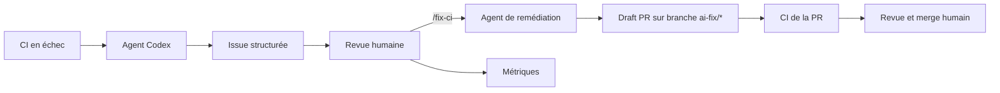

# ADLC CI Triage Demo

Cette démo montre un flux engineering contrôlé : une CI déterministe échoue, un agent Codex lit le run et ses logs, puis demande la création d’une seule issue de diagnostic à faire valider par un humain. Après validation explicite, un second agent peut proposer une correction dans une branche dédiée et une draft pull request.

La micro-application est une interface locale fictive de portefeuille PEA et crypto. Elle n’utilise aucune donnée Finary, aucun service externe et aucun secret.

## Flux



## Démarrage local

Pré-requis : Node.js 24 et npm.

```powershell
npm ci
npm run dev
```

Les contrôles de la CI sont exécutables localement :

```powershell
npm run lint
npm test
npm run typecheck
npm run build
```

Le failure-lab provoque exactement un échec choisi :

```powershell
npm run failure-lab -- test
npm run failure-lab -- lint
npm run failure-lab -- typecheck
```

## Publication GitHub par SSH — action manuelle requise

Les projets Finary de ce poste utilisent SSH avec la clé `id_ed25519_github_finary`. GitHub CLI n’est donc pas requis pour pousser ce dépôt.

1. Ouvrir [la création d’un nouveau dépôt GitHub](https://github.com/new), choisir le compte `fx69005`, saisir `adlc-ci-triage-demo`, sélectionner **Public**, et ne pas initialiser avec README, `.gitignore` ou licence.
2. Depuis la racine du dépôt local, ajouter le remote SSH et pousser `main` :

   ```powershell
   git remote add origin git@github.com:fx69005/adlc-ci-triage-demo.git
   git push -u origin main
   ```

3. Créer une clé API OpenAI dédiée au projet depuis la console OpenAI. Ne pas la mettre dans un fichier local ni dans une commande enregistrée dans l’historique.
4. Ajouter cette clé uniquement dans GitHub : `Settings → Secrets and variables → Actions → New repository secret`, nom `OPENAI_API_KEY`.
5. Vérifier que GitHub Actions est activé et que le dépôt public ne contient pas de secret dans les fichiers ou les logs.

## Compilation Agentic Workflows

La structure a été initialisée avec `gh-aw v0.81.6`. Les fichiers sources modifiables sont `.github/workflows/ci-triage.md` et `.github/workflows/ci-remediation.md` ; les fichiers exécutables compilés sont leurs équivalents `.lock.yml`.

Depuis un environnement authentifié :

```powershell
gh aw validate --strict
gh aw compile --strict --approve
git add .
git commit -m "feat: add ADLC CI triage demo"
git push -u origin main
```

Le workflow `CI Triage Agent` reste déclarativement déclenchable par `workflow_dispatch`, mais `CI Triage Dispatcher` peut maintenant le déclencher automatiquement après un échec de `CI` ou `Failure Lab`. Son seul safe output est `create-issue` avec `max: 1`. Il n’a pas le droit de modifier le code, d’ouvrir une pull request, de commenter, de merger ou de déployer.

Le workflow séparé `CI Remediation Agent` répond uniquement au commentaire `/fix-ci` dans une issue de triage. Il vérifie que les deux validations humaines sont cochées, modifie seulement `src/**` ou `scripts/**`, puis peut créer au maximum une draft PR vers `main` sur une branche `ai-fix/*`. Il ne merge jamais et ne modifie pas les fichiers protégés.

## Exécuter la démonstration — mode automatique et secours manuel

Le workflow `CI Triage Agent` se déclenche maintenant automatiquement lorsqu’un workflow `CI` ou `Failure Lab` terminé sur `main` possède la conclusion `failure`.

Pour chacun des trois scénarios (`test`, `lint`, `typecheck`) :

1. Ouvrir l’onglet **Actions**, sélectionner **Failure Lab**, cliquer sur **Run workflow**, choisir le scénario et confirmer.
2. Attendre l’échec contrôlé. L’URL du run reste visible pour le suivi, mais il n’est plus nécessaire de la copier en mode automatique.
3. Attendre que **CI Triage Agent** apparaisse automatiquement dans l’onglet **Actions**. Aucun collage d’URL n’est requis dans ce mode.
4. En cas de besoin, le bouton **Run workflow** de **CI Triage Agent** reste disponible comme secours manuel : choisir `main`, laisser `Agent caller context` vide, puis coller l’URL dans `ci_run_url`.
5. Vérifier que le run agent crée au maximum une issue `[CI triage] ...` avec les sections imposées dans le prompt.
6. Relire l’issue manuellement, appliquer la grille de `docs/evaluation.md`, puis cocher l’acceptation dans le registre `docs/metrics.md`.
7. Consulter le résumé du run dans GitHub pour reporter la durée, le nombre d’issues et les AIC observés. `gh aw logs` reste une option si GitHub CLI est authentifié séparément pour l’API.

Ces actions humaines restent indispensables : l’issue est une proposition de diagnostic, pas une autorisation de corriger ou de déployer. Le déclenchement est automatique, mais la validation de la sortie reste humaine.

## Demander une correction par PR

Une fois le diagnostic vérifié :

1. Cocher `Diagnostic accepté` et `Cause vérifiée dans le dépôt et les logs` dans l’issue.
2. Ajouter un commentaire dont le premier mot est exactement `/fix-ci`.
3. Attendre le workflow **CI Remediation Agent**.
4. Examiner la draft PR, sa branche `ai-fix/*`, son diff et les quatre contrôles CI.
5. Merger uniquement après revue humaine et CI verte.

Pour que la CI se déclenche sur une PR créée par l’agent, ajouter séparément le secret `GH_AW_CI_TRIGGER_TOKEN` contenant un PAT finement limité avec `Contents: Read & Write`. Ne jamais placer la valeur du token dans le dépôt ou dans les logs.

## Documentation ADLC

- `docs/adlc.md` : phases Plan → Build → Test → Deploy → Operate, remédiation contrôlée, permissions, prompt injection et revue humaine.
- `docs/evaluation.md` : trois scénarios, causes attendues et grille d’acceptation.
- `docs/metrics.md` : registre de durée, acceptation, erreurs, issues et consommation.

## Portabilité

La démonstration utilise GitHub Agentic Workflows, avec compilation d’un Markdown en workflow GitHub Actions `.lock.yml`. Une future variante GitLab pourrait conserver la même logique — URL du job échoué → agent en lecture seule → rapport structuré → revue humaine — dans un job GitLab CI, sans réutiliser directement les mécanismes GitHub `safe-outputs`.

## Non-objectifs V1

Pas de correction sans commande humaine explicite, pas de modification directe de `main`, pas de merge automatique, pas de déploiement, pas d’orchestrateur autonome, pas de multi-agent non contrôlé, pas de MCP tiers, pas de données réelles et pas d’intégration GCP.
