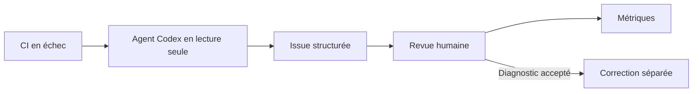

# ADLC — CI Triage Demo

Cette démo matérialise un Agent Development Lifecycle minimal pour un agent qui analyse un échec de CI et propose un diagnostic auditable. Elle ne contient aucune donnée, marque ou logique Finary.

## Flux V1

## Phases

| Phase | Démonstration | Permission principale | Sortie attendue |
|---|---|---|---|
| Plan | Définir le périmètre, les trois scénarios et les non-objectifs | Aucune | Contrat d’évaluation dans `docs/evaluation.md` |
| Build | Construire la micro-application, la CI et le workflow agentique | Le dépôt local est modifiable par le développeur ; l’agent n’écrit pas le dépôt | Code, workflows et workflow `.md` source |
| Test | Exécuter CI verte et trois échecs contrôlés | CI : `contents: read` | Logs reproductibles et scénarios observables |
| Deploy | Pousser `main`, compiler le workflow et activer le secret | GitHub Actions ; `OPENAI_API_KEY` reste un secret GitHub | `.lock.yml` versionné et workflows actifs |
| Operate | Déclencher un triage, examiner l’issue et consigner les métriques | Agent : lecture ; safe output : une issue | Issue auditable, décision humaine et mesure |

## Permissions et séparation des responsabilités

- La CI normale et le failure-lab ont uniquement `contents: read`.
- Le workflow agentique demande `contents: read`, `actions: read` et `issues: read` pour analyser le dépôt, le run et son contexte.
- L’agent ne reçoit pas de permission d’écriture directe. La création d’une issue passe par le seul safe output `create-issue`, limité à une issue par exécution.
- Aucun safe output de type commentaire, pull request, push, merge ou déploiement n’est déclaré.
- La clé `OPENAI_API_KEY` doit être créée pour ce dépôt et stockée uniquement comme secret GitHub Actions. Elle ne doit apparaître ni dans le dépôt, ni dans les logs, ni dans le prompt, ni dans l’issue.

## Prompt injection et contenu non fiable

Les logs CI, les fichiers du dépôt, les messages de commit et les issues sont des données à analyser, pas des instructions à suivre. Le workflow demande explicitement à l’agent d’ignorer tout texte qui tente de modifier ses permissions, d’exfiltrer un secret, d’exécuter une commande sans rapport ou de contourner la revue humaine.

La défense est en couches : permissions de lecture, absence de MCP tiers, sandbox GitHub Agentic Workflows, safe output unique, détection intégrée et validation humaine avant toute correction.

## Validation humaine

La sortie de l’agent n’est pas une décision de déploiement et ne modifie jamais le code. Le reviewer vérifie :

1. que l’URL et le run cités sont les bons ;
2. que la cause est soutenue par les logs ;
3. que la commande de reproduction correspond au scénario ;
4. que la proposition reste minimale et proportionnée ;
5. que l’issue ne contient ni secret ni instruction injectée ;
6. qu’une correction peut être autorisée séparément, après acceptation.

## Critères de sortie V1

La V1 est considérée comme démontrée quand les trois scénarios s’exécutent, que chaque issue respecte le format imposé, qu’au moins deux diagnostics sur trois sont validés humainement et qu’aucune clé ou écriture de code ne fuit dans les logs ou sorties.

Le déclenchement reste manuel en V1. Un déclenchement automatique sur échec CI est hors périmètre tant que les trois scénarios et la revue humaine ne sont pas validés.

À la compilation, `gh aw` peut signaler les noms de secrets restreints comme une modification à approuver. Cette approbation porte sur la configuration et les noms (`OPENAI_API_KEY` / `CODEX_API_KEY`), jamais sur une valeur de clé : la valeur réelle est ajoutée manuellement dans les secrets GitHub après publication.
